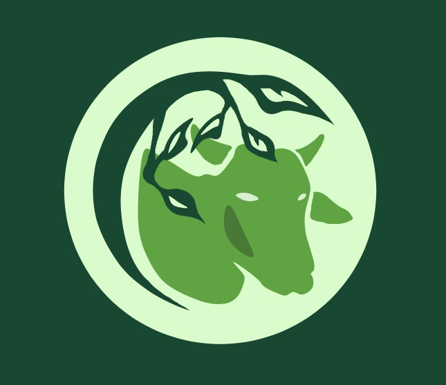

# AgroChat

Desafio Hackathon SERPRO da CPAmazônia 2023

## Descrição 

O projeto consiste no resultado do Desafio Hackathon da CPAmazônia 2023, o qual propõe o desafio de iniciativa do Serpro, em parceria com o Ministério da Agricultura e Pecuária (MAPA). O objetivobconsiste em promover o desenvolvimento de soluções inovadoras que utilizem a tecnologia para favorecer a implantação do Plano de Adaptação à Mudança do Clima e Baixa Emissão de Carbono na Agropecuária (ABC+).

## Detalhes
<!--ts-->
   * [Vídeo Pitch](#)
   * [Vídeo Demo](https://youtube.com/shorts/igeE1SR0M9I?feature=share)
   * [Apresentação](#apresentacao)
   * [Ferramentas](#ferramentas)
      * 

<!--te-->
## Colaboradores
<table>
  <tr>
    <td align="center">
      <a href="http://github.com/u/64561542"> 
        " width="100px;" alt="Foto de Giovanna no GitHub"/> 
        
        
          <b>teodororo</b>
        
      </a>
    </td>
  </tr>
   <tr>
    <td align="center">
      <a href="http://github.com/kaiqu3santos"> 
        " width="100px;" alt="Foto de Kaique no GitHub"/> 
        
        
          <b>kaiqu3santos</b>
        
      </a>
    </td>
  </tr>
<tr>
    <td align="center">
      <a href="http://github.com/ramonfava"> 
        " width="100px;" alt="Foto de Ramon no GitHub"/> 
        
        
          <b>ramonfava</b>
        
      </a>
    </td>
  </tr>
        </table>
          
## Status
Em andamento
